# Assistente Acadêmico com RAG: Uso de Inteligência Artificial para Resolução de Dúvidas da UNIVESP (Vespinho)

## Sumário
1.  [Visão Geral do Projeto](#visão-geral-do-projeto)
2.  [O Problema](#o-problema)
3.  [Nossa Solução: O "Vespinho"](#nossa-solução-o-vespinho)
4.  [Metodologia](#metodologia)
5.  [Protótipos Explorados](#protótipos-explorados)
    * [Protótipo 1: Open WebUI + Ollama](./docs/prototipo-ollama-webui.md)
    * [Protótipo 2: Microsoft Copilot Studio (Versão Inicial)](./docs/prototipo-copilot-studio-inicial.md)
6.  [Arquitetura da Solução Final](#arquitetura-da-solução-final)
7.  [Funcionalidades Detalhadas do "Vespinho"](#funcionalidades-detalhadas-do-vespinho)
8.  [Resultados e Impacto](#resultados-e-impacto)
9.  [Principais Aprendizados e Contribuições](#principais-aprendizados-e-contribuições)
10. [Limitações do Projeto](#limitações-do-projeto)
11. [Trabalhos Futuros](#trabalhos-futuros)
12. [A Equipe](#a-equipe)
13. [Vídeo de Apresentação](#vídeo-de-apresentação)
14. [Como Contribuir](#como-contribuir)
15. [Licença](#licença)

---

## 1. Visão Geral do Projeto
Este projeto, intitulado "Assistente Acadêmico com RAG: Uso de Inteligência Artificial para Resolução de Dúvidas da UNIVESP", teve como objetivo principal desenvolver e implementar um chatbot acadêmico inteligente, o "Vespinho". A finalidade é aprimorar o suporte e a experiência de aprendizado dos estudantes da Universidade Virtual do Estado de São Paulo (UNIVESP), fornecendo respostas rápidas, precisas e contextualizadas para dúvidas frequentes. 

O "Vespinho" utiliza a técnica de **Geração Aumentada por Recuperação (RAG)**, que combina modelos de linguagem generativa com a capacidade de buscar informações em uma base de conhecimento específica, composta por documentos oficiais da UNIVESP. Isso garante que as respostas sejam fundamentadas e atualizadas.

---

## 2. O Problema
A iniciativa de desenvolver o "Vespinho" surgiu da constatação, por meio de pesquisas quantitativas e qualitativas com os alunos da UNIVESP, de dificuldades recorrentes no acesso a informações institucionais. Muitos estudantes relatavam:
* Demora excessiva para obter respostas a dúvidas sobre processos institucionais, calendários acadêmicos, prazos, regras curriculares e utilização de plataformas digitais. 
* Informações fragmentadas, contraditórias ou tardias obtidas em canais informais. 
* Dificuldades com a interface e usabilidade das plataformas digitais oferecidas. 
* Falta de um canal oficial ágil para consulta, levando à perda de prazos e desmotivação. 

Esses desafios impactavam negativamente a experiência acadêmica, evidenciando a necessidade de uma solução tecnológica que facilitasse o acesso à informação de maneira eficiente e centralizada. 

---

## 3. Nossa Solução: O "Vespinho"
O "Vespinho" é um assistente virtual (chatbot) projetado para ser o ponto central de informações para os alunos da UNIVESP. Ele foi desenvolvido utilizando a plataforma **Microsoft Copilot Studio** e está hospedado em uma página dedicada no **SharePoint** da instituição, garantindo fácil acesso e integração.

**Principais Características:**
- **Respostas Baseadas em RAG:**  
  Utiliza documentos oficiais da UNIVESP (manuais, FAQs, Projetos Pedagógicos de Curso) como fonte primária para gerar respostas, garantindo precisão e relevância.  
  O mecanismo RAG (Retrieval-Augmented Generation) opera com **banco de dados vetorial e busca semântica**, permitindo localizar e utilizar trechos de documentos com maior contextualização e aderência à pergunta do usuário.

- **Disponibilidade 24/7:**  
  Oferece suporte contínuo, permitindo que os alunos tirem dúvidas a qualquer momento.

- **Interface Amigável:**  
  Projetado para ser intuitivo e de fácil utilização.

- **Atualização Contínua:**  
  A base de conhecimento pode ser atualizada pela equipe do projeto para refletir as informações mais recentes da universidade.

- **Infraestrutura com SharePoint e Copilot Studio:**  
  A solução foi desenvolvida utilizando o **SharePoint da Microsoft**, que atua como front e backend, em conjunto com o **Copilot Studio**, garantindo integração nativa com os dados e ferramentas da plataforma Microsoft.

---

## 4. Metodologia
O desenvolvimento do "Vespinho" seguiu a abordagem do **Design Thinking**, descrita por Tim Brown, complementada por práticas ágeis. Este método centrado no usuário envolveu as seguintes etapas:
1.  **Empatia (Ouvir e Interpretar o Contexto):** Coleta de informações sobre as demandas dos estudantes através de questionários online e observação de grupos de discussão. 
2.  **Definição:** Análise dos dados coletados para identificar as principais dores e necessidades dos alunos, delimitando o escopo do problema a ser resolvido.
3.  **Ideação:** Brainstorming e desenvolvimento de conceitos para o chatbot, focando em funcionalidades que abordassem as necessidades identificadas. 
4.  **Prototipagem (Criar e Prototipar):** Desenvolvimento de protótipos iniciais utilizando diferentes tecnologias para avaliar a viabilidade e eficácia. 
    * Backend: Implementação de modelos de IA com RAG. 
    * Frontend: Criação de interfaces web responsivas e acessíveis. 
5.  **Teste (Implementar e Testar):** Os protótipos foram submetidos a testes-piloto e avaliados pela equipe e, posteriormente, por um grupo de usuários da comunidade UNIVESP através de um segundo questionário. 
6.  **Iteração (Ajustes e Refinamentos Contínuos):** Com base nos feedbacks, foram implementados ajustes e melhorias contínuas na solução. 

Essa abordagem iterativa e colaborativa garantiu que a solução final estivesse alinhada com as expectativas e necessidades reais dos estudantes. 

---

## 5. Protótipos Explorados
Antes de chegarmos à solução final, exploramos diferentes abordagens e tecnologias. Detalhes sobre cada protótipo podem ser encontrados nos seguintes documentos:

* ### [Protótipo 1: Open WebUI + Ollama](./docs/prototipo-ollama-webui.md)
    * **Descrição:** Este protótipo utilizou uma combinação do Open WebUI para o frontend e Ollama para o backend, permitindo a execução local de Grandes Modelos de Linguagem (LLMs) e uma configuração detalhada do processo RAG. 
    * **Tecnologias Chave:** Ollama, Open WebUI, Modelos de Embedding customizados, Busca Híbrida, Modelos de Reclassificação (Reranking). 
    * **Insights:** Alta customização, excelente adaptabilidade a diferentes dispositivos, interface moderna. 
    * **Desafios:** Complexidade na infraestrutura de hospedagem e manutenção, custos operacionais contínuos. 
    * **Documentação de Referência:**
        * [Ollama - Repositório GitHub](https://github.com/ollama/ollama)
        * [Open WebUI - Repositório GitHub](https://github.com/open-webui/open-webui)

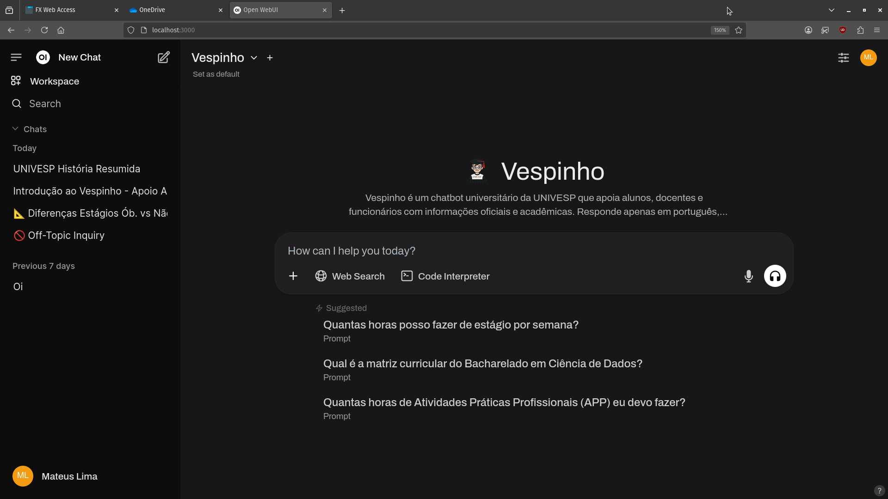  
**Figura 1** - Interface inicial do chatbot no Open Web UI.

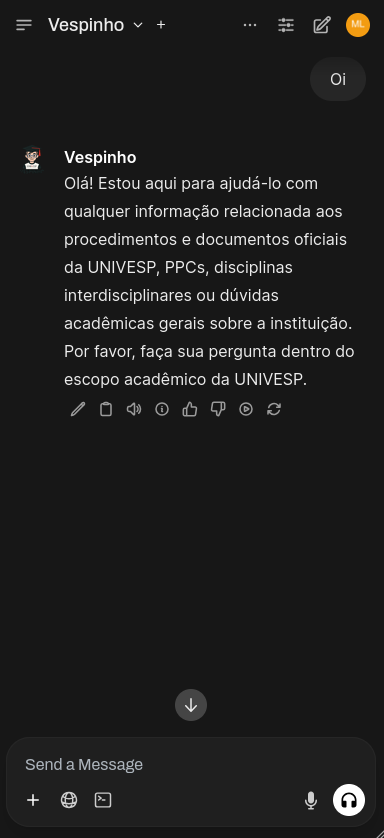  
**Figura 2** - Resposta do chatbot numa tela de celular pela interface do Open Web UI.

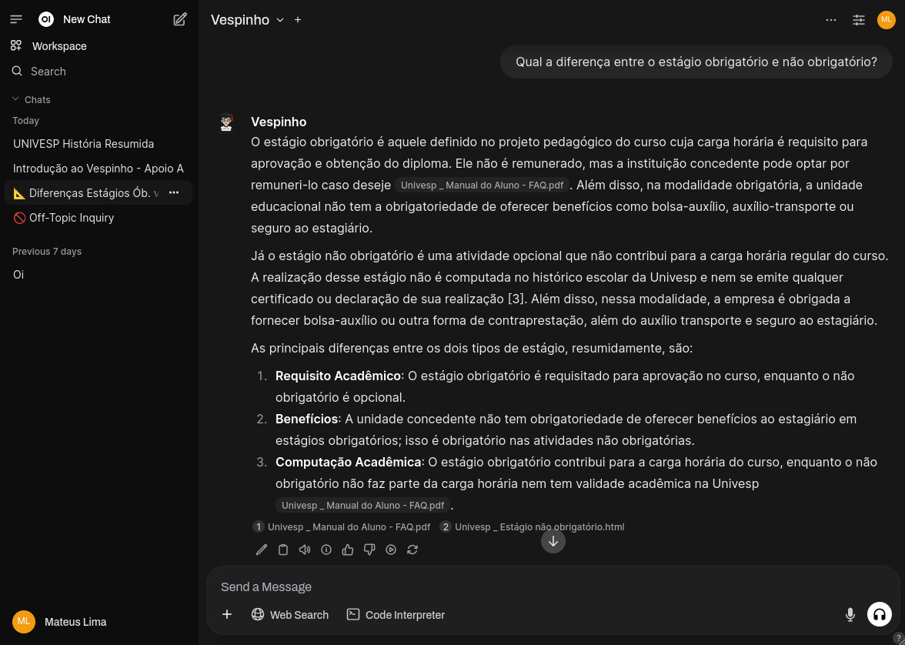  
**Figura 3** - Exemplo de diálogo e resposta gerada pelo chatbot (via Open Web UI) em uma tela responsiva de tablet.

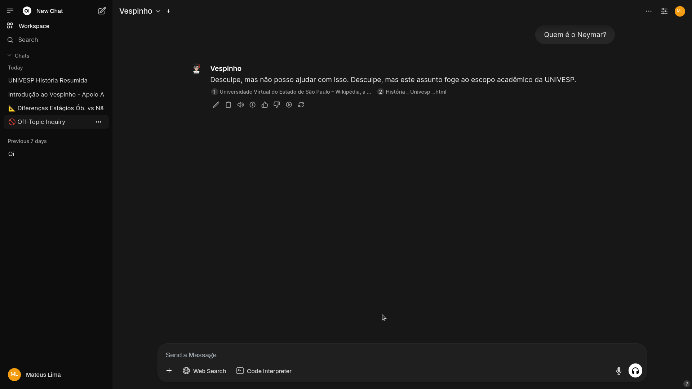  
**Figura 4** - Validação de contexto e evidência de que o chatbot restringe perguntas fora do escopo.

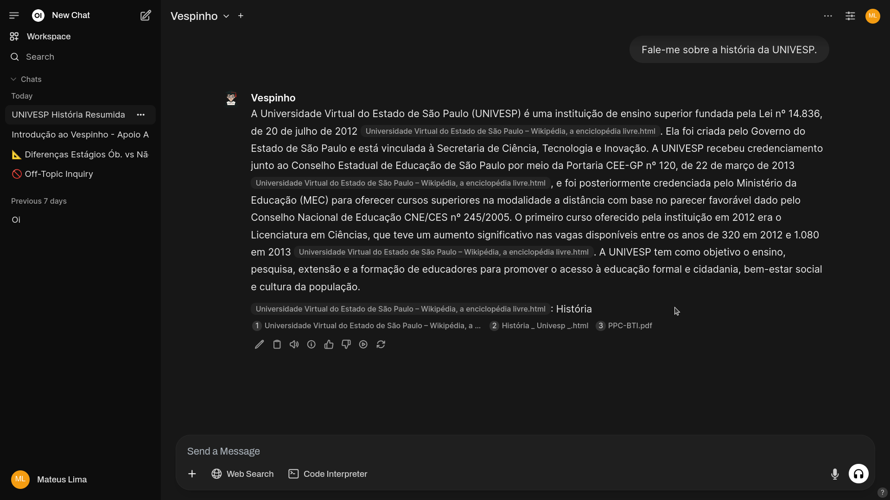  
**Figura 5** - Exemplo de diálogo e resposta gerada pelo chatbot (via Open Web UI) fundamentada em documentos.

* ### [Protótipo 2: Microsoft Copilot Studio (Versão Inicial)](./docs/prototipo-copilot-studio-inicial.md)
    * **Descrição:** O primeiro protótipo desenvolvido com o Microsoft Copilot Studio (anteriormente Power Virtual Agents) demonstrou grande potencial devido à sua integração com o ecossistema Microsoft e a facilidade na implementação da RAG. 
    * **Tecnologias Chave:** Microsoft Copilot Studio, RAG automatizado, Banco Vetorial integrado, Busca Semântica automatizada. 
    * **Insights:** Rápida implantação, treinamento com documentos da UNIVESP (manual do aluno), atualização automática das informações a partir das fontes. 
    * **Vantagens:** Acesso via conta acadêmica, menor necessidade de infraestrutura própria, escalabilidade. 
    * **Documentação de Referência:**
        * [Microsoft Copilot Studio - Documentação Oficial](https://learn.microsoft.com/pt-br/microsoft-copilot-studio/)
        
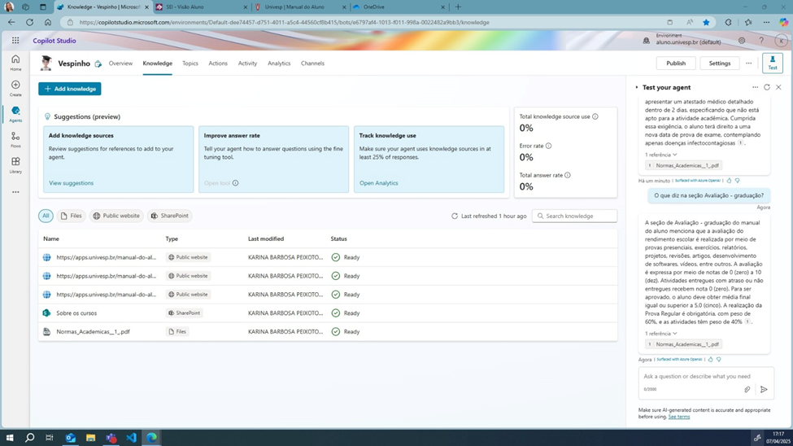  
**Figura 6** - Configuração de base de conhecimento e tela inicial do chatbot “Vespinho” no Microsoft Copilot Studio.

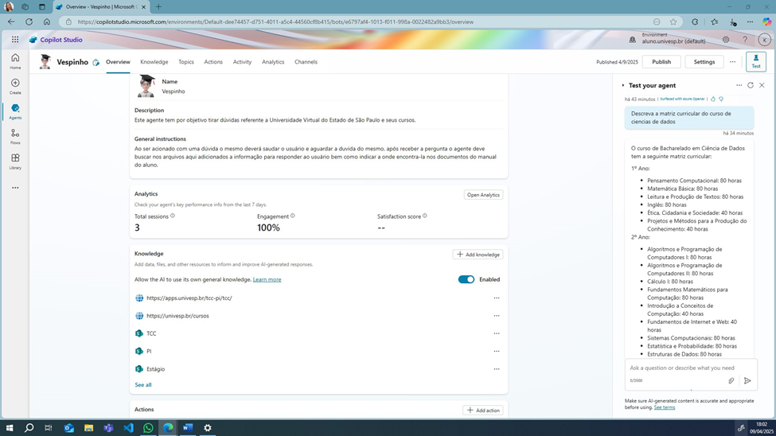  
**Figura 7** - Exemplo de Interação com o chatbot “Vespinho” no Microsoft Copilot Studio.

  
**Figura 8** - Exemplo 2 de Interação com o chatbot “Vespinho” no Microsoft Copilot Studio.

Após análise e testes, o **Microsoft Copilot Studio** foi escolhido para a solução final devido à sua robustez, facilidade de manutenção, integração com o SharePoint e a capacidade de atualização contínua e automática das informações. 

---

## 6. Arquitetura da Solução Final
A solução final do "Vespinho" é construída sobre os seguintes componentes:

* **Plataforma de Desenvolvimento do Chatbot:** Microsoft Copilot Studio.
    * Responsável pela lógica de conversação, integração com a base de conhecimento e gerenciamento das interações do usuário.
* **Base de Conhecimento (Knowledge Source):**
    * Documentos oficiais da UNIVESP (Manual do Aluno, Projetos Pedagógicos de Curso, FAQs, etc.) armazenados em uma pasta dedicada no SharePoint. 
    * O Copilot Studio utiliza esses documentos para aplicar a técnica RAG, indexando o conteúdo para busca semântica e geração de respostas.
* **Plataforma de Hospedagem da Interface:** Página no SharePoint.
    * Serve como o portal de acesso principal para os alunos interagirem com o Vespinho. 
    * Oferece um ambiente seguro, integrado ao ecossistema da UNIVESP.

**Fluxo de Interação:**
1.  O aluno acessa a página do Vespinho no SharePoint.
2.  O aluno envia uma pergunta ao chatbot.
3.  O Microsoft Copilot Studio processa a pergunta.
4.  Utilizando RAG, o sistema busca informações relevantes nos documentos da UNIVESP armazenados no SharePoint.
5.  O Copilot Studio gera uma resposta contextualizada com base nas informações recuperadas.
6.  A resposta é apresentada ao aluno na interface do chat.

---

## 7. Funcionalidades Detalhadas do "Vespinho" (Solução Final no SharePoint)

A solução final, integrada ao SharePoint, apresenta diversas melhorias e funcionalidades focadas na experiência do usuário e na precisão das informações.

### Página Inicial Dedicada no SharePoint (Figura 9)

- Um portal centralizado e oficial para acessar o "Vespinho", aumentando sua visibilidade e credibilidade.
- Interface intuitiva apresentando o propósito do projeto.

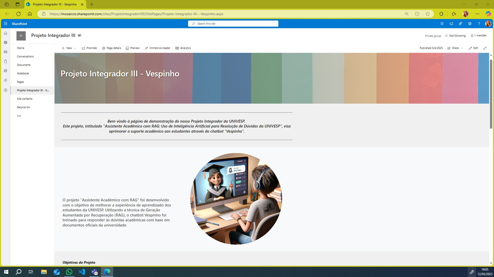  
**Figura 9** - Página inicial no SharePoint.

### Primeira Interação Guiada (Figura 10)

- Saudação clara e apresentação das funcionalidades.
- Sugestões de tópicos de ajuda comuns para orientar o usuário.

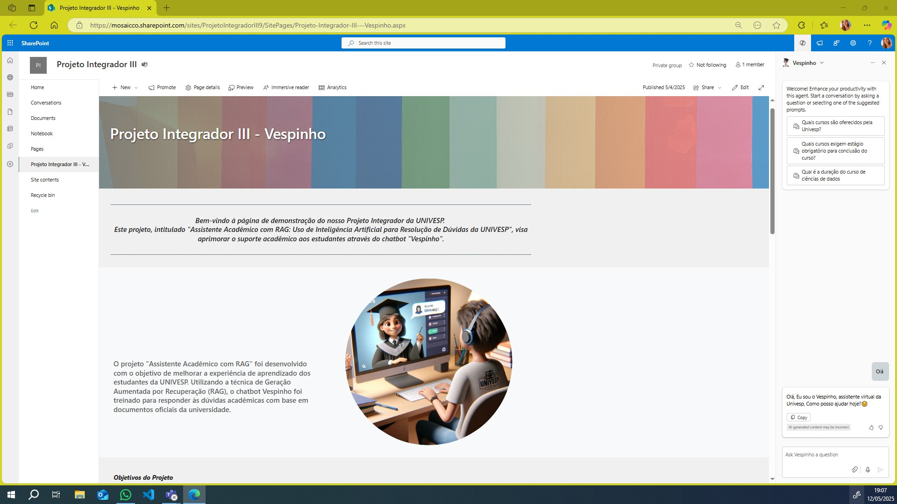  
**Figura 10** - Primeira interação com o usuário.

### Respostas com Referência à Fonte (Figura 11)

- Capacidade de citar o documento original (manual do aluno, PPCs) de onde a informação foi extraída, aumentando a confiança do usuário.
- Demonstração prática da RAG.

  
**Figura 11** - Respostas com referência à fonte oficial.

### Configuração e Personalização do Agente (Figuras 12, 13, 14)

- **Identidade Visual (Figura 12):** Avatar "Vespinho", descrição e mensagens de saudação personalizadas para uma interação mais amigável.  
  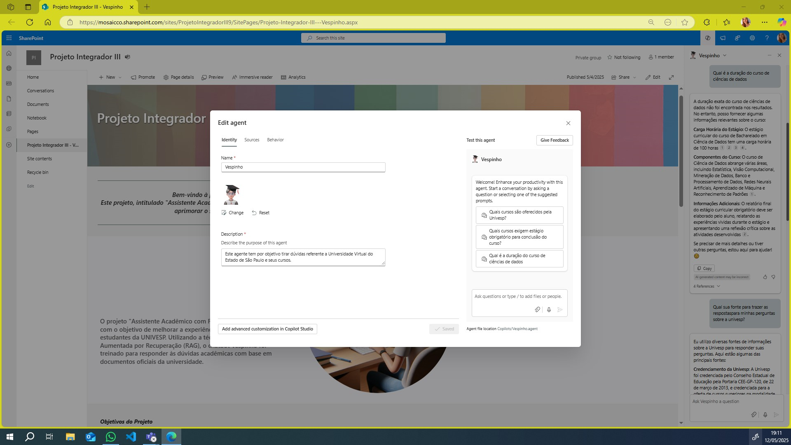  
  **Figura 12** - Configuração de identidade visual do agente.

- **Fontes de Conhecimento (Figura 13):** Gerenciamento centralizado dos documentos (Manuais, PPCs, FAQs) no SharePoint, permitindo atualizações ágeis e segmentadas. Possibilidade de adicionar conteúdo via links.  
    
  **Figura 13** - Fontes de conhecimento utilizadas pelo chatbot.

- **Comportamento da Conversa (Figura 14):** Programação de fluxos de conversa, previsão de intenções e ofertas proativas para otimizar a interação.  
  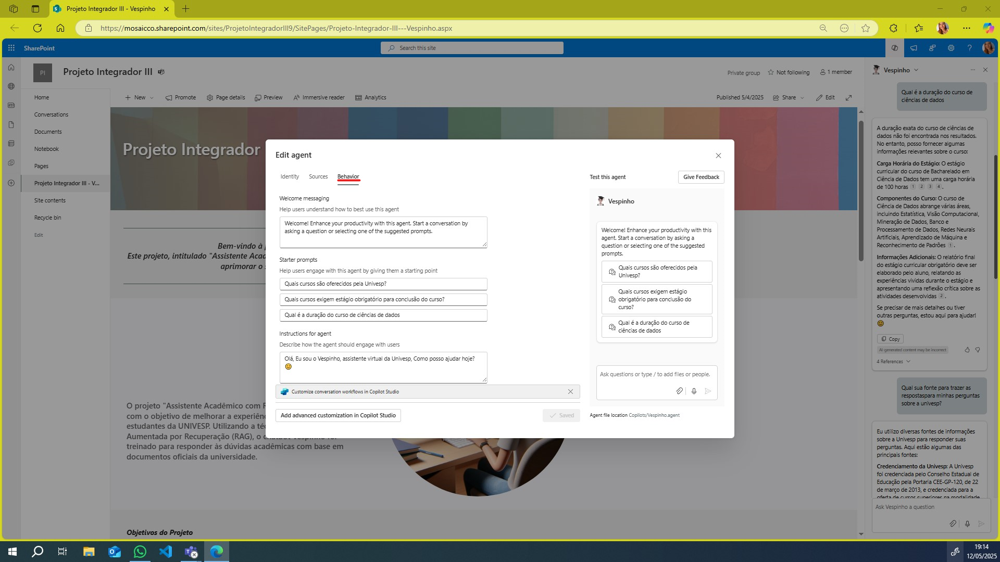  
  **Figura 14** - Configuração de comportamento da conversa.

### Apresentação Transparente do Projeto (Figuras 15 e 16)

- A página do SharePoint também serve para apresentar detalhes sobre o projeto, metodologia, resultados preliminares e a equipe envolvida, construindo confiança.

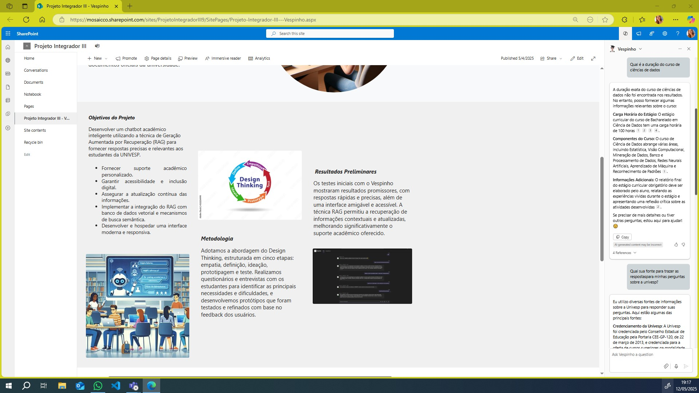  
**Figura 15** - Apresentação do projeto na página do SharePoint.

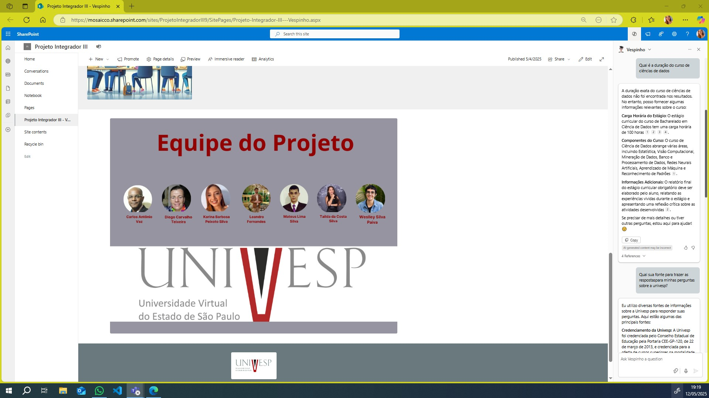  
**Figura 16** - Equipe envolvida no desenvolvimento do Vespinho.

---

## 8. Resultados e Impacto

A implementação do "Vespinho" e os testes subsequentes demonstraram resultados promissores e um impacto positivo no suporte aos estudantes.

* **Levantamento Inicial de Necessidades:**
    * Mais de 60% dos alunos levavam de 3 a mais de 24 horas para obter respostas. 
    * Aproximadamente 40% relatavam dificuldades com as plataformas digitais. 
    * 96,4% dos alunos desejavam notificações sobre eventos e prazos. 

* **Escolha da Plataforma:**
    * O Microsoft Copilot Studio foi selecionado como a solução mais viável e alinhada após a comparação com o protótipo baseado em Ollama/OpenWebUI, devido à gratuidade inicial, atualização automática e facilidade de manutenção. 

* **Validação da Solução Final (Segundo Questionário):**
    * **Adoção:** Muitos dos que responderam os questionários utilizaram o Vespinho durante o período de testes.
    * **Principais Usos:**
        * Busca de documentos e informações institucionais.
        * Esclarecimento de dúvidas acadêmicas gerais.
    * Este feedback confirmou a relevância da ferramenta e direcionou ajustes finais para aumentar a precisão e clareza.
    * **Link para o formulário de feedback (para referência):** [Questionário Vespinho - Feedback](https://docs.google.com/forms/d/e/1FAIpQLSef6pXvJy8aOP1RBSwtTab1PMxJwgNrZb4-elXQaSDsxUMTCA/viewform?usp=header)

* **Impacto Esperado:**
    * Redução significativa do tempo de espera por respostas. 
    * Padronização e maior confiabilidade das informações fornecidas. 
    * Diminuição da carga sobre os canais de suporte tradicionais. 
    * Aumento da autonomia e satisfação dos estudantes. 

---

## 9. Principais Aprendizados e Contribuições

Este projeto proporcionou valiosos aprendizados e contribuições significativas:

* **Importância da Abordagem Centrada no Usuário:** A metodologia Design Thinking foi crucial para garantir que a solução atendesse às necessidades reais dos estudantes. 
* **Potencial da IA (RAG) na Educação:** A técnica RAG demonstrou ser eficaz para criar assistentes virtuais capazes de fornecer informações precisas e contextualizadas a partir de uma base de conhecimento específica. 
* **Viabilidade de Soluções de Baixo Custo/Complexidade:** O uso do Microsoft Copilot Studio e SharePoint permitiu desenvolver uma solução robusta com recursos acessíveis (conta acadêmica).
* **Valor da Interdisciplinaridade:** O sucesso do projeto dependeu da integração de conhecimentos de diversas áreas, como Leitura e Produção de Textos, Pensamento Computacional, Algoritmos, Gestão da Inovação e Aprendizado de Máquina. 
* **Contribuição para a Comunidade UNIVESP:** Entrega de uma ferramenta funcional que pode melhorar diretamente a experiência acadêmica dos alunos. 
* **Estudo de Caso Aplicado:** O projeto serve como um exemplo prático da aplicação de tecnologias de IA para resolver problemas reais no contexto da educação a distância no Brasil. 

---

## 10. Limitações do Projeto

Apesar dos resultados positivos, reconhecemos algumas limitações:

* **Dependência da Base de Conhecimento:** A precisão e abrangência do "Vespinho" estão diretamente ligadas à qualidade, atualização e organização dos documentos oficiais fornecidos pela UNIVESP.
* **Escopo das Respostas:** Questões muito subjetivas, altamente específicas ou fora do escopo dos documentos podem não ser respondidas adequadamente.
* **Evolução Tecnológica:** O campo da IA está em constante evolução. Novas técnicas e modelos podem surgir, exigindo atualizações futuras para manter a vanguarda da solução.
* **Recursos de Manutenção:** Embora o Copilot Studio simplifique a manutenção, a curadoria da base de conhecimento e o monitoramento do chatbot ainda exigirão dedicação contínua.

---

## 11. Trabalhos Futuros

Para aprimorar ainda mais o Vespinho, consideramos as seguintes possibilidades:

* **Expansão da Base de Conhecimento:** Incluir mais documentos e FAQs de diferentes áreas e cursos da UNIVESP.
* **Integração com Outros Sistemas:** Explorar a integração com o Ambiente Virtual de Aprendizagem (AVA) ou outros sistemas acadêmicos para fornecer informações mais personalizadas.
* **Análise de Sentimento:** Implementar funcionalidades para analisar o sentimento do usuário e adaptar o tom da conversa ou escalar para um atendente humano, se necessário.
* **Suporte Multilíngue:** Considerar a inclusão de outros idiomas, se relevante para a comunidade UNIVESP.
* **Personalização Avançada:** Permitir que os usuários personalizem notificações ou áreas de interesse.
* **Métricas de Desempenho Detalhadas:** Aprimorar o monitoramento do uso e da satisfação para identificar continuamente áreas de melhoria.

---

## 12. A Equipe
Este projeto foi desenvolvido por um grupo de estudantes dedicados dos cursos de Bacharelado em Tecnologia da Informação, Bacharelado em Ciência de Dados e Engenharia de Computação da UNIVESP.

* Carlos Antônio Vaz, 2210809
* Daiana Viana Barbosa Nogueira, 2201733
* Diego Carvalho Teixeira, 2201887
* Karina Barbosa Peixoto Silva, 2203297
* Leandro Fernandes, 2207995
* Mateus Lima Silva, 2204430
* Tailda da Costa Silva, 2221092
* Weslley Silva Paiva, 2200797

**Tutora:** Juliana Ferreira Machado 

---

## 13. Vídeo de Apresentação
Assista ao vídeo de apresentação do Projeto Integrador para uma visão geral e demonstração do "Vespinho":
📽️ **[Vídeo de Apresentação do Projeto](https://youtu.be/VztZ6KWPung)**  

## 14. Como Contribuir
Agradecemos o interesse em contribuir com o projeto Vespinho! No momento, o desenvolvimento principal é conduzido pela equipe do projeto como parte das atividades acadêmicas. No entanto, sugestões e feedbacks são sempre bem-vindos e podem ser enviados através das "Issues" neste repositório (se aplicável) ou para os contatos da equipe.

---

## 15. Licença
Este projeto é disponibilizado sob a licença MIT. Por favor, consulte a lincensa para mais detalhes.